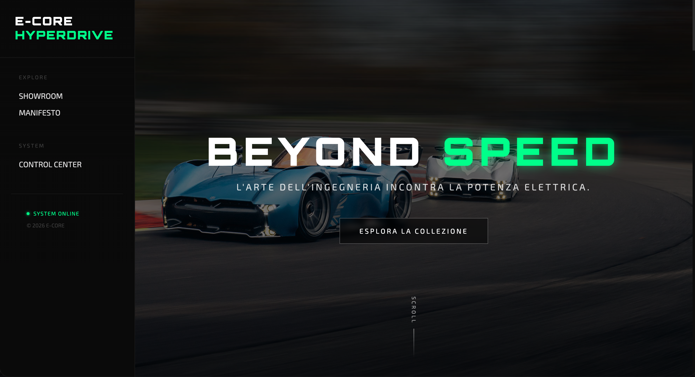

# 🏎️ E-Core Hyperdrive

> **L'arte dell'ingegneria incontra la potenza elettrica.**

**E-Core Hyperdrive** è una piattaforma web all'avanguardia per la gestione e l'esposizione di hypercar elettriche di lusso. Ispirato al design minimalista e sofisticato, questo progetto unisce performance e un'interfaccia utente immersiva.

<div align="center">
  
</div>

Costruito con le più recenti tecnologie Microsoft, è un esempio di applicazione **Blazor Server** moderna, containerizzata con **Docker** e pronta per il cloud.

---

## ✨ Caratteristiche Principali

*   **Showroom Immersivo**: Una vetrina interattiva per esplorare le hypercar più esclusive al mondo (Rimac, Lotus, Pininfarina, ecc.).
*   **Design "Luxury" & Responsive**:
    *   Layout fluido che si adatta perfettamente a mobile, tablet e desktop.
    *   Effetti visivi avanzati (Glassmorphism, Glitch Text, animazioni CSS).
    *   Tipografia curata (Orbitron, Exo 2) per un look futuristico.
*   **Pannello Amministrativo Completo**:
    *   Autenticazione e gestione sicura.
    *   CRUD (Create, Read, Update, Delete) completo per gestire il parco auto.
    *   Caricamento immagini tramite URL.
*   **Architettura Solida**:
    *   Backend in **.NET 10** (Preview).
    *   **Entity Framework Core** con database **SQLite**.
    *   **Seeding automatico** del database all'avvio.

---

## 🛠️ Tech Stack

*   **Framework**: .NET 10 & Blazor Server (.NET Interactive Server Render Mode)
*   **Database**: SQLite con Entity Framework Core
*   **Containerization**: Docker
*   **Styling**: CSS3 personalizzato (no framework pesanti), Bootstrap (solo grid system)
*   **Hosting**: Render (via Docker Container)

---

## 🐳 Guida Rapida (Avvio con Docker)

Il metodo consigliato per avviare l'applicazione è tramite **Docker**, che garantisce un ambiente isolato e coerente.

### Prerequisiti
*   [Docker Desktop](https://www.docker.com/products/docker-desktop/) installato e avviato.
*   [Git](https://git-scm.com/) (per clonare il repository).

### 1. Clona il Repository
```bash
git clone https://github.com/tuo-username/E-Core-Hyperdrive.git
cd E-Core-Hyperdrive
```

### 2. Costruisci l'Immagine
Dalla root del progetto (dove c'è il file `Dockerfile`):

```bash
docker build -t ecorehyperdrive:latest .
```

### 3. Avvia il Container
```bash
docker run -p 8080:8080 ecorehyperdrive:latest
```
Apri il browser su `http://localhost:8080`.

*Nota: Il database SQLite verrà creato automaticamente all'interno del container.*

---

## 🛠️ Sviluppo (Alternativa .NET Watch)

Se vuoi modificare il codice e vedere i cambiamenti in tempo reale (Hot Reload), puoi usare direttamente l'SDK .NET.

### Prerequisiti
*   [.NET SDK 10](https://dotnet.microsoft.com/download) (o versione compatibile).

### Avvio in modalità Dev
```bash
cd ECoreHyperdrive
dotnet watch
```
Il sito sarà accessibile su `http://localhost:5224` (o la porta indicata nel terminale).

---

## ☁️ Deploy su Render

Questo progetto è ottimizzato per il deploy su **Render** tramite Docker.

1.  Crea un account su [Render.com](https://render.com).
2.  Clicca su **"New"** -> **"Web Service"**.
3.  Collega il tuo repository GitHub.
4.  Seleziona **"Docker"** come Runtime.
5.  Render rileverà automaticamente il `Dockerfile`.
6.  Clicca su **"Create Web Service"**.

*Render costruirà l'immagine Docker e la metterà online automaticamente.*

---

## 🤝 Come Contribuire

Il progetto è open source e accogliamo volentieri contributi! Ecco come puoi aiutare:

1.  **Forka** il repository.
2.  Crea un **Branch** per la tua feature (`git checkout -b feature/NuovaFeature`).
3.  **Committa** le tue modifiche (`git commit -m 'Aggiunta NuovaFeature'`).
4.  Fai il **Push** sul branch (`git push origin feature/NuovaFeature`).
5.  Apri una **Pull Request**.

### Idee per Miglioramenti
- [ ] Aggiunta di un sistema di autenticazione più robusto (Identity).
- [ ] Integrazione con Azure Blob Storage per le immagini.
- [ ] Pagina di dettaglio per ogni singola auto.
- [ ] Filtri avanzati nello showroom.

---

## 👤 Autore

Progetto creato da [Henry](https://github.com/henry8913).

## 📫 Contatti

<div align="center">

[](https://henrygdeveloper.com/)
[](https://linkedin.com/in/henry-k-grecchi-555454254)
[](mailto:henry8913@hotmail.it)
[](https://api.whatsapp.com/send/?phone=393926936916&text&type=phone_number&app_absent=0)

</div>


---

## 📄 Licenza

Questo progetto è rilasciato sotto licenza [GNU GPLv3](LICENSE.txt).
